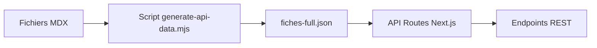

# API REST

L'API REST permet d'accéder aux fiches du référentiel de manière programmatique.

## :rocket: Démarrage rapide

### Interface Swagger UI

L'API est documentée avec Swagger UI. Accédez à l'interface interactive :

- **Local** : [http://localhost:3000/swagger-ui.html](http://localhost:3000/swagger-ui.html)
- **Production** : `https://votre-domaine.com/swagger-ui.html`

La spec OpenAPI JSON est disponible à `/api-docs/swagger`.

## :zap: Endpoints disponibles

### Liste des langues

```http
GET /api/languages
```

Retourne la liste des langues disponibles dans le référentiel.

**Réponse** :
```json
{
  "data": ["fr", "en", "es"],
  "default": "fr"
}
```

---

### Liste des versions

```http
GET /api/versions
```

Retourne la liste des versions distinctes présentes dans les fiches publiées.

**Réponse** :
```json
{
  "data": ["1.0.0", "2.0.0"],
  "meta": {
    "total": 2
  }
}
```

---

### Liste des fiches

```http
GET /api/fiches
GET /api/fiches?lang=fr
GET /api/fiches?version=1.0.0
```

Retourne la liste de toutes les fiches publiées.

**Paramètres de query** :
- `lang` (optionnel) : Code de langue (fr, en, es). Par défaut : langue du référentiel
- `version` (optionnel) : Version du référentiel (ex: "1.0.0") ou "latest". Par défaut : "latest"

**Réponse** :
```json
{
  "data": [
    {
      "id": "1.01",
      "title": "Exemple de bonne pratique",
      "lang": "fr",
      "versions": [
        {
          "version": "1.0.0",
          "idRef": "1.01"
        }
      ],
      "url": "/fr/fiches/FAKE_1.01-installation-exemple"
    }
  ],
  "meta": {
    "total": 42,
    "lang": "fr",
    "version": "latest"
  }
}
```

**Erreur 400** (langue non supportée) :
```json
{
  "error": "Unsupported language",
  "message": "Language \"de\" is not supported. Available languages: fr, en, es"
}
```

---

### Récupérer une fiche par ID

```http
GET /api/fiches/{id}
GET /api/fiches/{id}?lang=fr
GET /api/fiches/{id}?version=1.0.0
```

Retourne les détails d'une fiche spécifique.

**Paramètres** :
- `id` (requis) : Identifiant de la fiche (ex: "1.01")

**Paramètres de query** :
- `lang` (optionnel) : Code de langue
- `version` (optionnel) : Version du référentiel ou "latest"

**Réponse** :
```json
{
  "data": {
    "id": "1.01",
    "title": "Exemple de bonne pratique",
    "lang": "fr",
    "versions": [
      {
        "version": "1.0.0",
        "idRef": "1.01"
      }
    ],
    "url": "/fr/fiches/FAKE_1.01-installation-exemple",
    "currentVersion": "1.0.0"
  }
}
```

**Erreur 400** (langue non supportée) :
```json
{
  "error": "Unsupported language",
  "message": "Language \"de\" is not supported. Available languages: fr, en, es"
}
```

## :link: Utilisation de l'URL

Chaque fiche contient un champ `url` qui permet d'accéder directement à la fiche :

```javascript
const fiche = await fetch('/api/fiches/1.01').then(r => r.json());
const ficheUrl = `https://votre-domaine.com${fiche.data.url}`;
// => https://votre-domaine.com/fr/fiches/FAKE_1.01-installation-exemple

// Ouvrir dans une nouvelle fenêtre
window.open(ficheUrl, '_blank');
```

## :bulb: Exemples d'utilisation

### JavaScript / TypeScript

```typescript
// Récupérer toutes les fiches en français
const fiches = await fetch('/api/fiches?lang=fr')
  .then(r => r.json());

console.log(fiches.data); // Array de fiches
console.log(fiches.meta.total); // Nombre total

// Récupérer une fiche spécifique
const fiche = await fetch('/api/fiches/1.01?lang=fr')
  .then(r => r.json());

console.log(fiche.data.title);
console.log(fiche.data.url);
```

### cURL

```bash
# Liste toutes les fiches
curl https://votre-domaine.com/api/fiches

# Récupère une fiche spécifique
curl https://votre-domaine.com/api/fiches/1.01

# Avec des paramètres
curl "https://votre-domaine.com/api/fiches?lang=fr&version=1.0.0"
```

### Python

```python
import requests

# Récupérer toutes les fiches
response = requests.get('https://votre-domaine.com/api/fiches?lang=fr')
data = response.json()

for fiche in data['data']:
    print(f"{fiche['id']}: {fiche['title']}")
    print(f"  URL: {fiche['url']}")
```

## :gear: Génération des données

Les données de l'API sont générées automatiquement lors du build à partir des fichiers MDX.

### Manuellement

Pour régénérer les données de l'API sans rebuild complet :

```bash
node scripts/generate-api-data.mjs
```

Le fichier généré : `public/api-data/fiches-full.json`

### Automatiquement

Les données sont régénérées lors de :
- `pnpm build` (production)
- `pnpm build-local` (local)

## :warning: Points importants

!!!warning Fiches publiées uniquement
L'API retourne uniquement les fiches avec `published: true`
!!!

!!!info Cache
Les réponses sont mises en cache pour 1 heure (`Cache-Control: public, s-maxage=3600`)
!!!

!!!info Synchronisation
Les données de l'API sont synchronisées au moment du build. Pour voir les changements après modification d'une fiche, il faut rebuilder l'application.
!!!

!!!success Langues par défaut
Si aucune langue n'est spécifiée, l'API utilise la langue par défaut du référentiel (configurée dans `referentiel-config.ts`)
!!!

## :bug: Gestion des erreurs

### 404 - API data not found

```json
{
  "error": "API data not found",
  "message": "Please run 'node scripts/generate-api-data.mjs' to generate the API data"
}
```

**Solution** : Exécutez `node scripts/generate-api-data.mjs` ou rebuilder l'application.

### 404 - Fiche not found

```json
{
  "error": "Fiche not found",
  "message": "No fiche found with id \"X.XX\" for language \"fr\" and version \"latest\""
}
```

**Solution** : Vérifiez l'ID de la fiche, la langue et la version demandée.

## :books: Documentation interactive

Pour explorer l'API de manière interactive avec Swagger UI :

```
http://localhost:3000/swagger-ui.html
```

L'interface permet de :
- :eyes: Voir tous les endpoints disponibles
- :test_tube: Tester les endpoints directement dans le navigateur
- :page_facing_up: Voir les schémas de réponse détaillés
- :clipboard: Copier des exemples de code
- :arrow_down: Télécharger la spec OpenAPI

## Architecture technique

### Flux de génération



### Compatibilité

- :white_check_mark: **Compatible** avec TinaCMS (pas de conflit)
- :white_check_mark: **Compatible** avec Vercel et serveurs Node.js
- :x: **Incompatible** avec static export (`output: 'export'`)

### Cache et performance

- Cache HTTP : 1 heure (configurable)
- Données servies depuis un fichier JSON statique
- Pas de requête MongoDB nécessaire pour les API publiques
